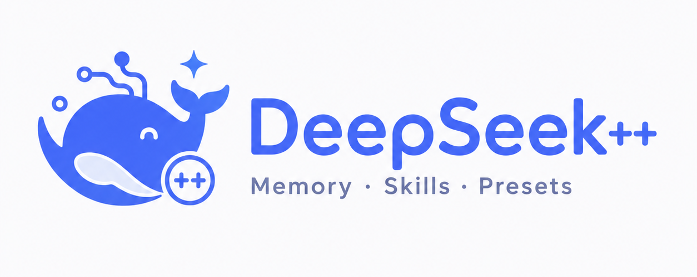
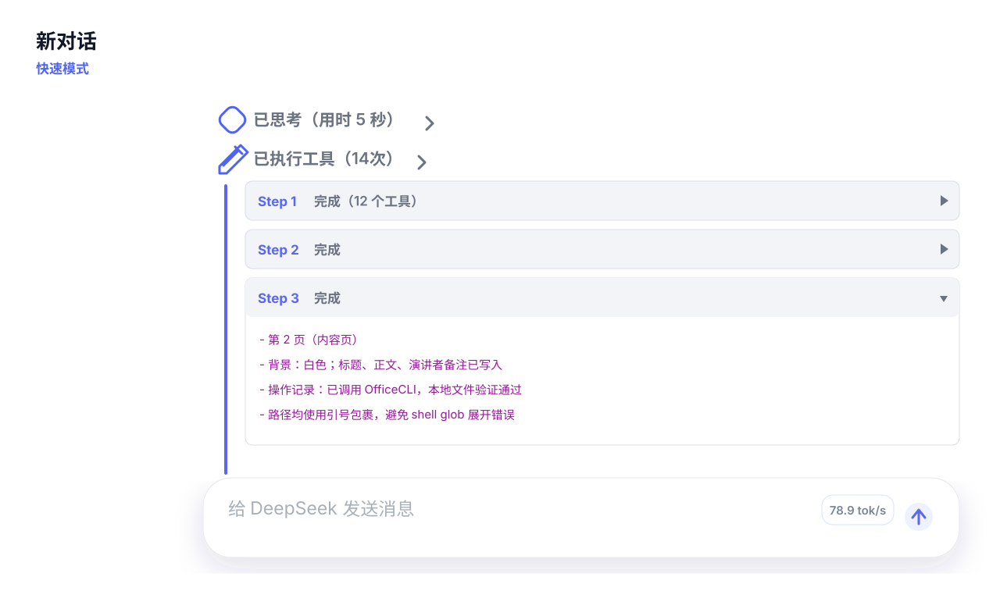
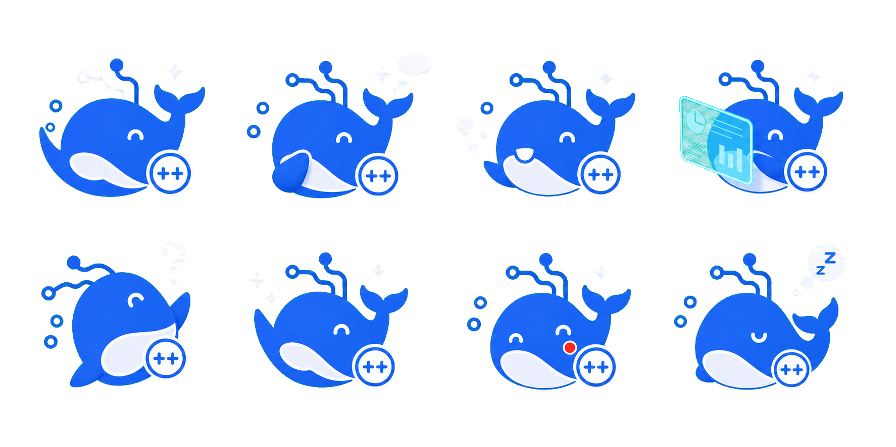
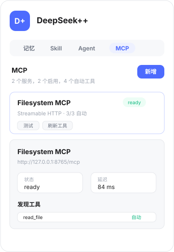
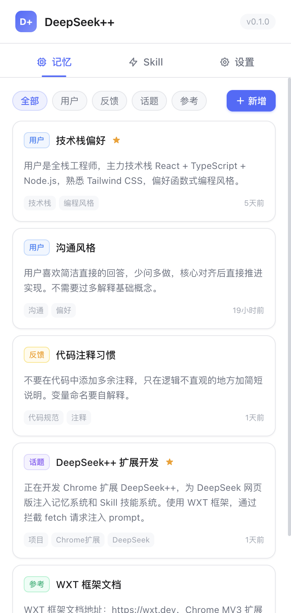
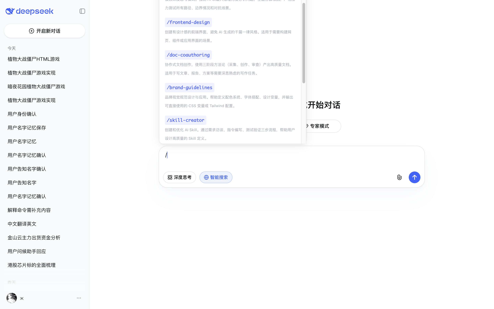
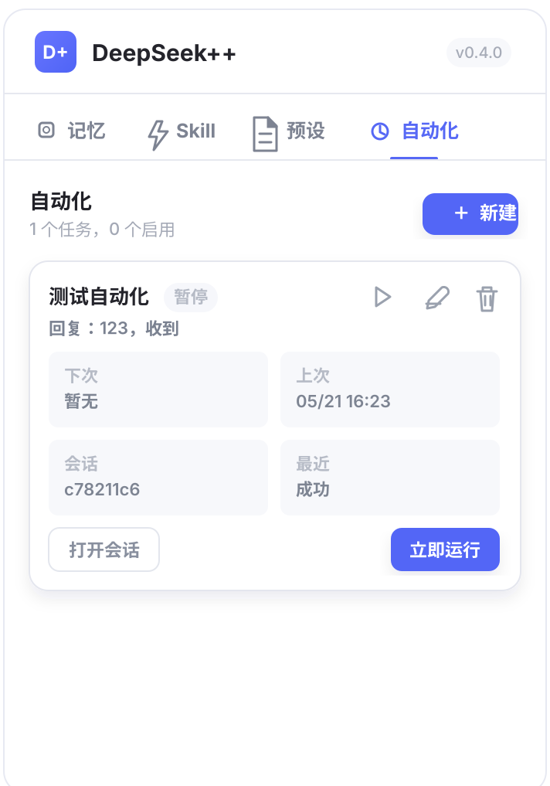

<p align="center">
  
</p>

<h1 align="center">DeepSeek++</h1>

<p align="center">
  <strong>Estende l'interfaccia web di DeepSeek in un vero workstation AI con memoria, strumenti, MCP, Skill e automazione</strong>
</p>

<p align="center">
  <a href="https://github.com/BorisLandoni/deepseek-pp/stargazers"></a>
  <a href="https://github.com/BorisLandoni/deepseek-pp/releases"></a>
  <a href="#licenza"></a>
  <a href="https://chat.deepseek.com"></a>
</p>

<p align="center">
  <a href="README.md">🇬🇧 English</a> &nbsp;·&nbsp;
  🇮🇹 Italiano &nbsp;·&nbsp;
  <a href="#funzionalità">Funzionalità</a> &nbsp;·&nbsp;
  <a href="#installazione">Installazione</a> &nbsp;·&nbsp;
  <a href="#crediti">Crediti</a>
</p>

> **Fork** di [zhu1090093659/deepseek-pp](https://github.com/zhu1090093659/deepseek-pp) — traduzione IT/EN a cura di Boris Landoni & AI.

DeepSeek++ è un'estensione per Chrome / Edge / Firefox per [DeepSeek](https://chat.deepseek.com). Aggiunge una barra laterale, chiamate a strumenti native, strumenti web integrati, sistema MCP, memoria a lungo termine, Skill, preset di prompt di sistema, esecuzione agenziale continua e automazione pianificata.

---

## Funzionalità

| Esigenza | DeepSeek++ offre |
|----------|------------------|
| Estensione Chrome per DeepSeek | Chat nella barra laterale, invio testo con clic destro, visualizzazione risultati strumenti, supporto multi-browser |
| Strumenti MCP per DeepSeek | Gestisci server MCP, permessi e stato di esecuzione dalla barra laterale; i risultati tornano alla stessa sessione |
| Memoria DeepSeek | Salva, filtra e inietta automaticamente memoria a lungo termine per preservare preferenze e contesto tra le sessioni |
| Skill DeepSeek / workflow `/skill` | Passa a modalità esperto o template di task con Skill integrate, personalizzate o importate da GitHub |
| Automazione DeepSeek | Pianifica task nella loro sessione DeepSeek — on-demand, cron o RRULE |
| Ricerca web / recupero pagine | Cerca su internet o recupera testo di pagine quando servono informazioni in tempo reale |

---

## Funzionalità principali

### Chat nella barra laterale
- **Ingresso opzionale** — abilita nelle Impostazioni per mostrare il tab Chat nella barra laterale
- **Clic destro per inviare** — seleziona testo in qualsiasi pagina, clic destro e invialo alla barra laterale
- **Scenari del menu contestuale** — configura template di prompt; il testo selezionato viene iniettato automaticamente
- **Nuove sessioni** — crea una nuova sessione dalla barra laterale in qualsiasi momento
- **Visualizzazione streaming** — le risposte vengono visualizzate in streaming nella barra laterale

### Chiamate a strumenti native
- **Rilevamento ed esecuzione automatici** — l'estensione rileva ed esegue le chiamate a strumenti senza interazione utente
- **Output pulito** — la sintassi tecnica delle chiamate è nascosta; viene mostrato solo il risultato
- **Aspetto nativo** — i risultati si rendono come blocchi comprimibili (es. "Strumenti eseguiti (2)")
- **Catene multi-strumento** — più chiamate per risposta (es. salva diversi ricordi contemporaneamente)
- **Ripristino al refresh** — la cronologia di esecuzione sopravvive ai refresh della pagina
- **Indicatore di velocità** — `tok/s` in tempo reale mostrato accanto alla casella di input

<p align="center">
  
</p>

### Strumenti web integrati
- **Ricerca web** — `web_search` permette al modello di cercare su Bing informazioni in tempo reale
- **Recupero pagine** — `web_fetch` recupera il testo visibile di qualsiasi URL per riassunti o analisi
- **Continuazione automatica** — i risultati tornano alla stessa sessione e il modello continua
- **Controllo strumenti** — abilita o disabilita singoli strumenti dalla pagina Strumenti della barra laterale
- **Gestione permessi** — concedi accesso per sito a `web_fetch` direttamente dalla barra laterale
- **Diagnostica** — diagnostica di ricerca integrata per verificare lo stato di rete e permessi

### Esecuzione agenziale continua
- **Task multi-step** — come Claude Code / Codex, il modello decide il passo successivo in base ai risultati
- **Piegatura degli step** — gli step completati si chiudono automaticamente per non sommergere la lettura
- **Cadenza** — pause automatiche tra le richieste per ridurre il throttling della piattaforma
- **Ripristino al refresh** — la traccia di esecuzione e lo stato finale sopravvivono ai refresh
- **Stop manuale** — interrompi un task in esecuzione in qualsiasi momento

### Mascotte fluttuante 🐳
- **Sincronizzazione stati** — la balena DeepSeek segue gli stati dell'AI: pensiero, lavoro, risposta, successo, errore, inattività
- **Fumetti** — brevi frasi appaiono e si alternano durante le fasi di pensiero o lavoro prolungato
- **Riposizionabile** — fissala in basso a sinistra o destra, oppure trascinala in posizione personalizzata
- **Personalizzabile** — regola dimensione, opacità ed effetto fluttuante nelle Impostazioni
- **Persistente** — posizione e aspetto vengono salvati localmente

<p align="center">
  
</p>

### Sistema MCP
- **Connessioni flessibili** — aggiungi server MCP remoti o locali (HTTP, SSE, Stdio Bridge, Native Messaging)
- **Esecuzione automatica di default** — i nuovi server si eseguono automaticamente; passa a manuale per server o strumento
- **Gestione permessi** — autorizza, testa, aggiorna strumenti e visualizza lo stato dalla barra laterale
- **Risultati in feed-back** — i risultati degli strumenti tornano alla stessa sessione per continuare la generazione
- **Supporto agenziale** — i risultati MCP guidano l'esecuzione multi-step per task lunghi

<p align="center">
  
</p>

### Strumenti documento OfficeCLI
- **Skill `/officecli` integrata** — ispezione, rilevamento problemi, validazione e modifiche controllate su `.docx`, `.xlsx`, `.pptx`
- **Libreria Skill ufficiale** — DOCX, XLSX, PPTX, Pitch Deck, Academic Paper, Financial Model, Dashboard, Morph PPT
- **Libreria stili ufficiale** — indice stili PPT e descrizioni, componibili con `/officecli-pptx /officecli-styles ...`
- **Via Shell MCP** — il modello chiama il binario OfficeCLI locale tramite `shell_exec`
- **Auto-installazione** — `deepseek-pp-shell-host` installa il binario corretto per il tuo OS e CPU

Installazione Shell Native Host:
```bash
npx deepseek-pp-shell-host install --browser chrome --extension-id <ID_ESTENSIONE>
```
La pagina MCP della barra laterale compila automaticamente l'ID della tua estensione. Dopo l'installazione riavvia il browser, poi clicca **Shell** nella pagina MCP per creare il preset, quindi testa e aggiorna gli strumenti.

### Sistema di memoria
- **Memoria automatica** — le informazioni chiave vengono salvate automaticamente durante la conversazione
- **Iniezione intelligente** — la memoria rilevante viene selezionata per corrispondenza di parole chiave, peso di fissaggio e frequenza di accesso
- **Quattro tipi** — `user` (identità/preferenze), `feedback` (correzioni comportamento), `topic` (contesto discussione), `reference` (risorse esterne)
- **Gestione dalla barra laterale** — visualizza, modifica, fissa, elimina, filtra per tipo e gestisci i tag
- **Import / export** — backup e ripristino in blocco in formato JSON

<p align="center">
  
</p>

### Sistema Skill
- **Skill integrate** — skill generali e OfficeCLI pronte all'uso
- **Skill personalizzate** — crea skill con le tue istruzioni di sistema direttamente nella barra laterale
- **Import da GitHub** — anteprima e importazione di Skill da repo GitHub, directory o singolo file `SKILL.md`
- **Tracciamento sorgente** — repository, versione, licenza, tempo di sincronizzazione e verifica aggiornamenti upstream
- **Abilitazione/disabilitazione** — le Skill personalizzate e importate si possono attivare singolarmente
- **Trigger `/`** — digita `/` nella casella chat per l'autocompletamento; il prompt di sistema viene iniettato automaticamente
- **Integrazione memoria** — inietta facoltativamente il contesto memoria insieme alla skill

<p align="center">
  
</p>

### Preset di prompt di sistema
- **Preset multipli** — crea diversi preset di prompt di sistema per ruoli o tipi di task diversi
- **Uno attivo alla volta** — attiva un preset; viene iniettato prima del primo messaggio di ogni nuova conversazione
- **Compatibile con Skill** — il contenuto del preset si combina con le istruzioni Skill e il contesto memoria

### Automazione
- **Manuale o pianificata** — crea task nella pagina Automazione; esegui subito o imposta un cron/RRULE
- **Sessioni dedicate** — ogni task ottiene la propria sessione DeepSeek, riutilizzata nelle esecuzioni successive
- **Pianificazione flessibile** — manuale, cron (es. `0 9 * * *`) e RRULE (es. `FREQ=HOURLY;INTERVAL=1`), intervallo minimo 15 minuti
- **Controllo completo** — metti in pausa, modifica, elimina task e apri la sessione dalla card del task
- **Monitoraggio stato** — prossima esecuzione, ultima esecuzione, stato recente e messaggi di errore su ogni card
- **Pipeline completa** — l'automazione passa anche per preset, memoria, strumenti MCP ed esecuzione agenziale

<p align="center">
  
</p>

### Sincronizzazione cloud (opzionale)
- **Sync WebDAV** — backup e sincronizzazione di ricordi, Skill e preset su qualsiasi server WebDAV (Nextcloud, ownCloud, ecc.)
- **Utile per** — condividere la configurazione tra più computer
- **Non obbligatoria** — se usi un solo computer puoi ignorare completamente questa sezione

---

## Aggiornamenti automatici

Quando viene rilasciata una nuova versione su GitHub, l'estensione mostra un banner giallo in cima alla barra laterale. Clicca **Scarica e aggiorna** per ottenere il nuovo zip, poi ricarica l'estensione in `chrome://extensions`.

---

## Installazione

### Dalla release GitHub (consigliato)

1. Scarica `deepseek-plus-plus-X.X.X-chrome.zip` dalle [Release](https://github.com/BorisLandoni/deepseek-pp/releases/latest)
2. Estrai in una cartella
3. Apri Chrome → `chrome://extensions` → abilita **Modalità sviluppatore**
4. Clicca **Carica estensione non pacchettizzata** → seleziona la cartella estratta

### Compilazione da sorgente

```bash
git clone https://github.com/BorisLandoni/deepseek-pp.git
cd deepseek-pp
npm install
npm run build:chrome
```

| Browser | Pagina di caricamento | Cartella build |
|---------|-----------------------|----------------|
| Chrome | `chrome://extensions/` → Carica estensione non pacchettizzata | `dist/chrome-mv3/` |
| Edge | `edge://extensions/` → Carica estensione non pacchettizzata | `dist/edge-mv3/` |
| Firefox | `about:debugging#/runtime/this-firefox` → Carica componente aggiuntivo temporaneo | `dist/firefox-mv3/manifest.json` |

---

## Cronologia versioni

<details>
<summary>v0.6.1 — Traduzione IT/EN + aggiornamenti automatici</summary>

| Area | Modifiche |
|------|-----------|
| Localizzazione | Interfaccia completamente in italiano e inglese — rimosso tutto il cinese |
| Selettore lingua | Modale di benvenuto al primo avvio + selettore permanente nelle Impostazioni |
| Aggiornamenti automatici | L'estensione controlla le release GitHub all'apertura e mostra un banner se disponibile una versione più recente |
| Mascotte | Frasi tradotte in IT + EN; la lingua segue quella selezionata nell'interfaccia |
| Prompt AI | Prompt di sistema tradotti in inglese per migliori prestazioni del modello |
| GitHub Actions | Build e release automatiche ad ogni push su `main` |
| Sezione Info | Crediti fork e traduzione aggiunti |

</details>

<details>
<summary>v0.6.0 — Chat barra laterale + workflow Skill</summary>

| Area | Modifiche |
|------|-----------|
| Chat barra laterale | Nuovo tab Chat (abilita nelle Impostazioni) — invia messaggi, crea sessioni, vedi risposte in streaming |
| Menu contestuale | Clic destro sul testo selezionato per inviarlo; supporto template di scenario personalizzati |
| Gestione Skill | Modifica, abilita, disabilita ed elimina Skill personalizzate |
| Import GitHub | Anteprima e importazione Skill da repo GitHub, directory o file `SKILL.md` |
| Permessi web_fetch | Autorizzazione per sito e opzione "autorizza tutti" nella pagina Strumenti |
| Visualizzazione risultati | Corretto risultato strumento assegnato al nodo risposta sbagliato |

</details>

---

## Crediti

- **Progetto originale:** [zhu1090093659/deepseek-pp](https://github.com/zhu1090093659/deepseek-pp)
- **Questo fork:** [BorisLandoni/deepseek-pp](https://github.com/BorisLandoni/deepseek-pp)
- **Traduzione IT/EN:** Boris Landoni & AI

## Progetti correlati

- [OfficeCLI](https://github.com/iOfficeAI/OfficeCLI) — CLI AI-friendly per l'elaborazione di documenti Office

## Licenza

MIT
